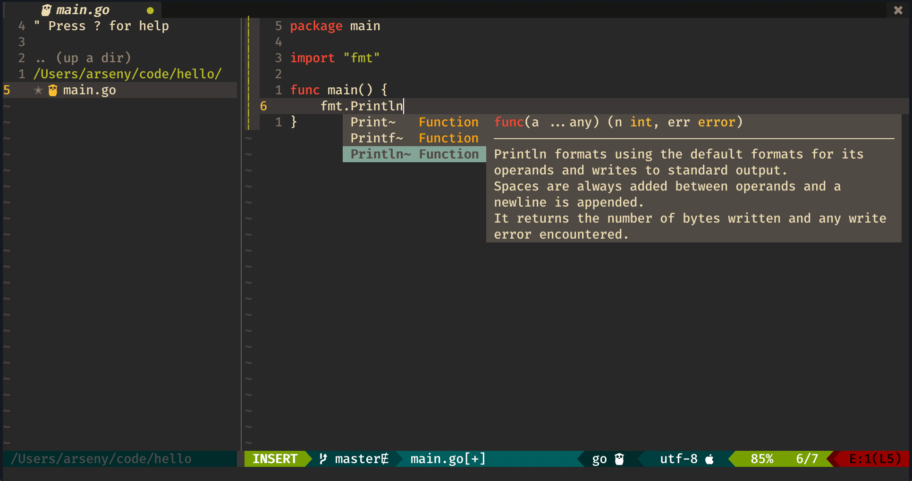

# dotfiles



## Setup
### iterm2
1. Install fonts from `iterm2/`
2. Import iterm2 profile

### zsh
```bash
echo 'source $HOME/dotfiles/.zshrc' > ~/.zshrc


# terraform
git clone https://github.com/macunha1/zsh-terraform \
    ${ZSH_CUSTOM:-~/.oh-my-zsh/custom}/plugins/terraform
```

### nvim
1. Install deps
```bash
curl -LO https://github.com/neovim/neovim/releases/download/v0.9.1/nvim-macos.tar.gz 
tar xzf nvim-macos.tar.gz

brew install \
    the_silver_searcher \
    fd \
    httpie \
    tmux \
    tig \
    git-secret \
    tmuxinator \
    hyperfine \
    tflint \
    hashicorp/tap/terraform-ls
```
2. Install `vim-plug` and do `:PlugInstall`

#### lsp
- pyright, volar
```bash
npm install -g \
    pyright \
    @volar/vue-language-server
```

### lua format
```bash
brew install luarocks
luarocks install --server=https://luarocks.org/dev luaformatter
# lua-format -i ./**/*.lua
```

