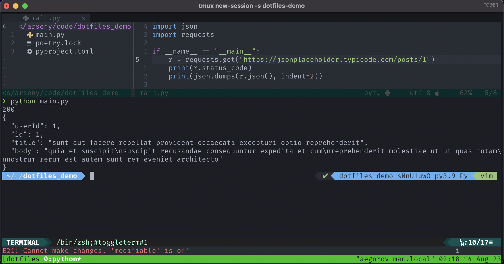

# dotfiles
### Demo
IDE                           | Terminal
:----------------------------:|:-------------------------:
  |  

### Installation
`mac`:
- Install `iterm2`
- Install fonts from the `iterm2/fira_code/` folder
- Install the `iterm2_profile.json` from the `iterm2/` folder
- Install `zsh`
- Run
   ```shell
   echo 'source $HOME/dotfiles/.zshrc' > ~/.zshrc
   ```
- Install `nvim`
   ```shell
   NVIM_VERSION=v0.9.1 curl -LO https://github.com/neovim/neovim/releases/download/$NVIM_VERSION/nvim-macos.tar.gz
   tar xzf nvim-macos.tar.gz
   mv nvim-macos nvim
   ```
- Install `vim-plug` and do `:PlugInstall` in neovim

### LSPs & packages 
- pyright: `npm install -g pyright`
- brew
  ```shell
  brew install \
    the_silver_searcher \
    fd \
    httpie \
    tmux \
    tig \
    git-secret \
    tmuxinator \
    hyperfine \
    tflint \
    hashicorp/tap/terraform-ls
  ```
- lua-format
  ```shell
  brew install luarocks
  luarocks install --server=https://luarocks.org/dev luaformatter
  # lua-format -i ./**/*.lua
  ```
